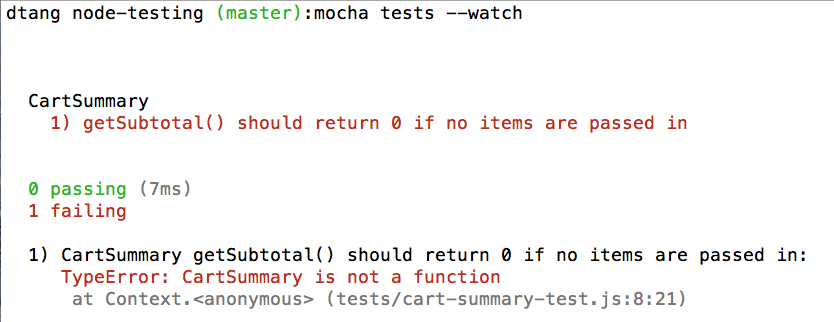
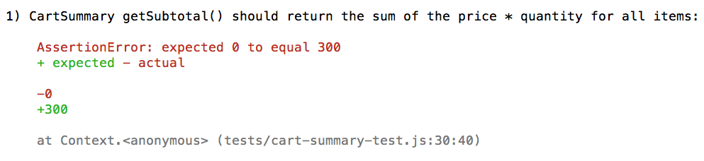

Unit Testing in Node
====================

Testing is an important practice in software development to improve software quality. There are many forms of testing; manual testing, acceptance testing, unit testing, and a few others. In this post we are going to look at unit testing in Node using the Mocha test framework. Unit tests typically make up the majority of test suites. Unit tests test small units of code, typically a method or a function, __in isolation__. The key thing to remember is the __in isolation__ aspect. In this post, we'll start off writing unit tests for a function that simply takes some input, returns some output, and has no dependencies. Then we will look at how we can write isolated unit tests for functions that make HTTP requests using a library called Nock. Finally we will look at how to test modules that depend on other modules using stubs provided by the Sinon library. Let's get started!

To install Mocha, simply run:

```
npm install mocha -g
```

Unlike other JavaScript testing frameworks like Jasmine and QUnit, Mocha does not come with an assertion library. Instead, Mocha allows you to choose your own. Popular assertion libraries used with Mocha include should.js, expect.js, Chai, and Node's built in `assert` module. In this post, we are going to use Chai.

First, let's create a `package.json` file and install Chai:

```
touch package.json
echo {} > package.json
npm install chai --save-dev
```

Chai comes with 3 different assertion flavors. It has the `should` style, the `expect` style, and the `assert` style. They all get the job done and choosing one is just a matter of preference in how you want the language of your tests to read. Personally I like the `expect` style so we will be using that.

### Your First Test

For our first example, we will use test driven development (TDD) to create a `CartSummary` constructor function, which will be used to total up items placed in a shopping cart. In short, TDD is the practice of writing tests first before an implementation to drive the design of your code. TDD is practiced in the following steps:

1. Write a test and watch it fail
2. Write the minimal amount of code to make that test pass
3. Repeat

By following this process, you are guaranteed to have tests for your code because you are writing them first. It is not always possible, or it is sometimes very difficult, to write unit tests for existing code without tests. Anyways, enough about TDD, let's see some code!

```js
// tests/cart-summary-test.js

var chai = require('chai');
var expect = chai.expect; // we are using the "expect" style of Chai
var CartSummary = require('./../src/cart-summary.js');

describe('CartSummary', function() {
  it('getSubtotal() should return 0 if no items are passed in', function() {
    var cartSummary = new CartSummary([]);
    expect(cartSummary.getSubtotal()).to.equal(0);
  });
});
```

The `describe` function is used to set up a group of tests with a name. I tend to put the module under test as the name. A test is written using the `it` function. The `it` function is given a description as the first argument of what the module under test should do. The second argument of the `it` function is a function that will contain one or more assertions (also called expectations) using Chai in this example. Our first test simply verifies that the subtotal is 0 if the cart has no items.

To run this test, run `mocha tests --watch` from the root of the project. You should see something like this:



Our test is failing because we have not yet implemented `CartSummary`. Let's do that.

```js
// src/cart-summary.js

function CartSummary() {}

CartSummary.prototype.getSubtotal = function() {
  return 0;
};

module.exports = CartSummary;
```

Here I've written the minimal amount of code to make our test pass.


Let's move on to our next test.

```js
it('getSubtotal() should return the sum of the price * quantity for all items', function() {
  var cartSummary = new CartSummary([{
    id: 1,
    quantity: 4,
    price: 50
  }, {
    id: 2,
    quantity: 2,
    price: 30
  }, {
    id: 3,
    quantity: 1,
    price: 40
  }]);

  expect(cartSummary.getSubtotal()).to.equal(300);
});
```



The failing output shows what value `getSubtotal` returned in red and what value we expected in green. Let's revise `getSubtotal` so our test passes.

```js
// src/cart-summary.js

function CartSummary(items) {
  this._items = items;
}

CartSummary.prototype.getSubtotal = function() {
  if (this._items.length) {
    return this._items.reduce(function(subtotal, item) {
      return subtotal += (item.quantity * item.price);
    }, 0);
  }

  return 0;
};
```

### Testing HTTP Requests

The code tested above is straighforward to test because it does not have any external dependencies. `getSubtotal` was simply given some input and returned an output. You're probably saying to yourself: "Most of my code makes database and web service calls. How do I test that?". Let me show you.

Let's say we want our `CartSummary` class to have a method for getting the tax from a subtotal. To calculate the tax, we are going to hit a fictitious API that deals with the intricacies of tax calculation. This API expects a POST request to https://some-tax-service.com/request with a JSON payload containing the subtotal. Now remember, unit tests are supposed to be isolated from database and API calls to ensure speed, predictability, and repeatability. If a unit test really hit an API, then it has an external dependency which makes that test brittle. If the API goes down or we make too many requests in a small time period, our test fails. If the API takes a long time to respond, our tests take longer to run. Instead, we want to simulate the request but not actually make it. As long as our implementation abides by the contract of the API, then our code should work when it hits the API for real. By simulating the API call in our unit test, our test suite is no longer dependent on the API and can execute much more quickly. So how do we unit test a method that makes an API call? Let me introduce [Nock](https://github.com/pgte/nock), an HTTP mocking library for Node. This library overrides Node's `http.request` function so that HTTP requests are not actually made. Let's see how we can use this in our test.

First, install Nock:

```
npm install nock --save-dev
```

Now we are going to use Nock to intercept the HTTP call to the tax API in our test.

```js
// tests/cart-summary-test.js

var nock = require('nock');

// ...

it('getTax() should execute the callback function with the tax amount', function(done) {
  nock('https://some-tax-service.com')
    .post('/request')
    .reply(200, function(uri, requestBody) {
      return {
        tax: JSON.parse(requestBody).subtotal * 0.10
      };
    });

  var cartSummary = new CartSummary([{
    id: 1,
    quantity: 4,
    price: 50
  }, {
    id: 2,
    quantity: 2,
    price: 30
  }, {
    id: 3,
    quantity: 1,
    price: 40
  }]);

  cartSummary.getTax(function(tax) {
    expect(tax).to.equal(30);
    done();
  });
});
```

In this test, when a POST request comes in to https://some-tax-service.com/request, Nock will execute our specified function that responds with a JSON payload that contains the tax, which is 10% of the the subtotal passed in the request payload.

This example also exhibits asynchronous testing. Specifying a parameter in the `it` function (called `done` in this example), Mocha will pass in a function and wait for it to execute before ending the tests. The test will timeout and error if `done` is not invoked within 2000 milliseconds.

Let's write the implementation of `getTax` to make this test pass.

```js
// src/cart-summary.js

CartSummary.prototype.getTax = function(done) {
  request.post({
    url: 'https://some-tax-service.com/request',
    method: 'POST',
    json: {
      subtotal: this.getSubtotal()
    }
  }, function(error, response, body) {
    if (!error && response.statusCode === 200) {
      done(body.tax);
    }
  });
};
```

Here `getTax` uses the `request` library to make a POST request to the tax API with a JSON payload containing the subtotal. When the request completes, the callback function passed to `getTax`, called `done`, will execute with that `tax` property in the JSON response.

### Stubbing with Sinon

Let's say we now want to break out our tax calculation into its own module so that it can be used in other parts of our system. We could simply move the code from `getTax` into its own `tax` module with its own test and call it from `getTax`.

```js
// src/tax.js

var request = require('request');

module.exports = {
  calculate: function(subtotal, done) {
    request.post({
      url: 'https://some-tax-service.com/request',
      method: 'POST',
      json: {
        subtotal: subtotal
      }
    }, function(error, response, body) {
      if (!error && response.statusCode === 200) {
        done(body);
      }
    });
  }
};
```

Here is the test for the new `tax` module.

```js
// tests/tax-test.js

describe('tax', function() {
  it('calculate() should execute the callback function with the tax amount', function(done) {
    nock('https://some-tax-service.com')
      .post('/request')
      .reply(200, function(uri, requestBody) {
        return {
          tax: JSON.parse(requestBody).subtotal * 0.10
        };
      });

    tax.calculate(100, function(taxInfo) {
      expect(taxInfo).to.eql({
        tax: 10
      });
      done();
    });
  });
});
```

Notice that in this test I am using `eql` instead of `equal`. `equal` asserts that the target is strictly equal (using ===) to the value whereas `eql` performs a deep comparison between the target and the value.

Here is our revised `getTax()` method:

```js
CartSummary.prototype.getTax = function(done) {
  tax.calculate(this.getSubtotal(), function(taxInfo) {
    done(taxInfo.tax);
  });
};
```

All tests should be passing. However, the test for `getTax` knows about the implementation of `tax.calculate` because it is using Nock to intercept the HTTP request made to the tax API service. If the implementation of `tax.calculate` changed, such as a different tax API service was used, our test for `getTax` would also need to change. Instead, a better approach would be to fake out `tax.calculate` when testing `getTax` using a stub, a controllable replacement. We can create this stub using the Sinon library.

To install Sinon, run:

```
npm install sinon --save-dev
```

Let's revise the `getTax` test to use a Sinon stub instead of Nock.

```js
// tests/cart-summary-2-test.js

describe('getTax()', function() {
  beforeEach(function() {
    sinon.stub(tax, 'calculate', function(subtotal, done) {
      done({
        tax: 30
      });
    });
  });

  afterEach(function() {
    tax.calculate.restore();
  });

  it('get Tax() should execute the callback function with the tax amount', function(done) {
    var cartSummary = new CartSummary([{
      id: 1,
      quantity: 4,
      price: 50
    }, {
      id: 2,
      quantity: 2,
      price: 30
    }, {
      id: 3,
      quantity: 1,
      price: 40
    }]);

    cartSummary.getTax(function(tax) {
      expect(tax).to.equal(30);
      done();
    });
  });
});
```

In this example, we are stubbing out `tax.calculate` with a pre-programmed replacement function that simply executes the callback with a static tax. This happens in a `beforeEach` block which executes before every test. After each test, the `afterEach` block is excuted which restores the original `tax.calculate`. By writing our test for the refactored `getTax` method using a stub instead of Nock, the test never has to change if the underlying implementation of `tax.calculate` changes. Note that the public interface of `tax.calculate` needs to be kept the same.

Sinon is a very powerful library and offers a lot more than just stubs including spies, mocks, fake servers, and plenty more.

### Conclusion

In this post, we looked at a few practical examples of unit testing in Node using the Mocha testing framework, the Chai assertion library, Nock for HTTP mocking, and Sinon for stubbing. I hope you enjoyed this post. If you have any questions, ask them below or reach me on Twitter [@skaterdav85](https://twitter.com/skaterdav85).

[Source code](https://github.com/skaterdav85/node-testing)
