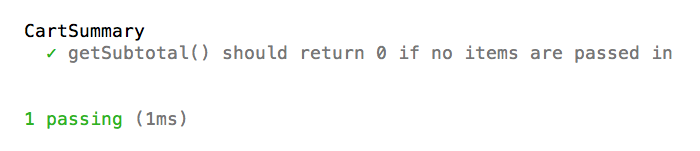

Unit Testing in Node
====================

In this post we are going to look at unit testing in Node using the Mocha test framework. To install Mocha, simply run:

```
npm install mocha -g
```

Unlike other JavaScript testing frameworks like Jasmine and QUnit, Mocha doesn't come with an assertion library. Instead, Mocha allows you to choose your own. Popular assertion libraries used with Mocha include should.js, expect.js, Chai, and Node's built in `assert` module. In this post, we're going to use Chai.

First, let's create a `package.json` file and install Chai:

```
touch package.json
echo {} > package.json
npm install chai --save-dev
```

Chai comes with 3 different assertion flavors. It has the `should` style, the `expect` style, and the `assert` style. They all get the job done and choosing one is just a matter of preference in how you want the language of your tests to read. Personally I like the `expect` style so we will be using that in this post.

### Your First Test

For our first example, we will use TDD to create a `CartSummary` constructor function, which will be used to total up items placed in a shopping cart.

```js
// tests/cart-summary-test.js

var chai = require('chai');
var expect = chai.expect;
var CartSummary = require('./../src/cart-summary.js');

describe('CartSummary', function() {
	it('getSubtotal() should return 0 if no items are passed in', function() {
		var cartSummary = new CartSummary([]);
		expect(cartSummary.getSubtotal()).to.equal(0);
	});
});
```

The `describe` function is used to set up a group of tests. The first argument is a name for a group of tests. I tend to put the module under test as the name. A test is written using the `it` function. Each `it` block will contain one or more assertions or expectations using Chai in this example. Our first test simply verifies that the subtotal is 0 if items is an empty array.

To run this test, run `mocha tests --watch` from the root of the project. You should see something like this:


Our test is failing because we have not yet implemented `CartSummary`. Let's do that.

```js
// src/cart-summary.js

function CartSummary() {}

CartSummary.prototype.getSubtotal = function() {
	return 0;
};

module.exports = CartSummary;
```

Here I've written the minimal amount of code to make our test pass.




Let's move on to our next test:

```js
it('getSubtotal() should return the sum of the price * quantity for all items', function() {
  var cartSummary = new CartSummary([
    {
      id: 1,
      quantity: 4,
      price: 50
    },
    {
      id: 2,
      quantity: 2,
      price: 30
    },
    {
      id: 3,
      quantity: 1,
      price: 40
    }
  ]);

  expect(cartSummary.getSubtotal()).to.equal(300);
});
```


The failing output shows what value `getSubtotal()` returned in red and what value we expected in green. Let's revise `getSubtotal()`:

```js
// src/cart-summary.js

CartSummary.prototype.getSubtotal = function() {
	if (this._items.length) {
		return this._items.reduce(function(subtotal, item) {
			return subtotal += (item.quantity * item.price);
		}, 0);
	}

	return 0;
};
```

### Testing HTTP Requests

So far writing tests hasn't been too difficult. At this point, you might be saying to yourself: "Most of my code makes database and web service calls. How do I test that?". Let me show you.

Let's say we want our `CartSummary` class to have a method for getting the tax for the subtotal. To figure out the tax, we're going to hit a fictitious API that deals with tax calculation. This API expects a POST request to https://some-tax-service.com/request with a JSON payload containing the subtotal. Now remember, unit tests are supposed to be isolated from database and API calls to ensure predictability and repeatability. So how do we unit test a method that makes an API call? Let me introduce [Nock](https://github.com/pgte/nock), an HTTP mocking library for Node. This library overrides Node's `http.request` function so that requests are not actually made. Let's see how we can use this in our test.

```js
// tests/cart-summary-test.js

var nock = require('nock');

// ...

it('getTax() should execute the callback function with the tax amount', function(done) {
  nock('https://some-tax-service.com')
    .post('/request')
    .reply(200, function(uri, requestBody) {
      return {
        tax: JSON.parse(requestBody).subtotal * 0.10
      };
    });

  var cartSummary = new CartSummary([
    {
      id: 1,
      quantity: 4,
      price: 50
    },
    {
      id: 2,
      quantity: 2,
      price: 30
    },
    {
      id: 3,
      quantity: 1,
      price: 40
    }
  ]);

  cartSummary.getTax(function(tax) {
    expect(tax).to.equal(30);
    done();
  });
});
```

In this test, when a POST request comes in to https://some-tax-service.com/request, Nock will respond with a JSON payload that contains the tax, which is 10% of the the subtotal passed in the request payload.

This example also exhibits asynchronous testing. Specifying a parameter in the `it()` block (called `done()` in this example), Mocha will pass in a function and wait for this function to execute before ending the tests. The test will timeout and error if `done()` is not invoked within 2000 milliseconds.

Let's write the implementation of `getTax()` to make this test pass.

```js
// src/cart-summary.js

CartSummary.prototype.getTax = function(done) {
	request.post({
		url: 'https://some-tax-service.com/request',
		method: 'POST',
		json: {
			subtotal: this.getSubtotal()
		}
	}, function(error, response, body) {
		if (!error && response.statusCode === 200) {
	    done(body.tax);
	  }
	});
};
```
